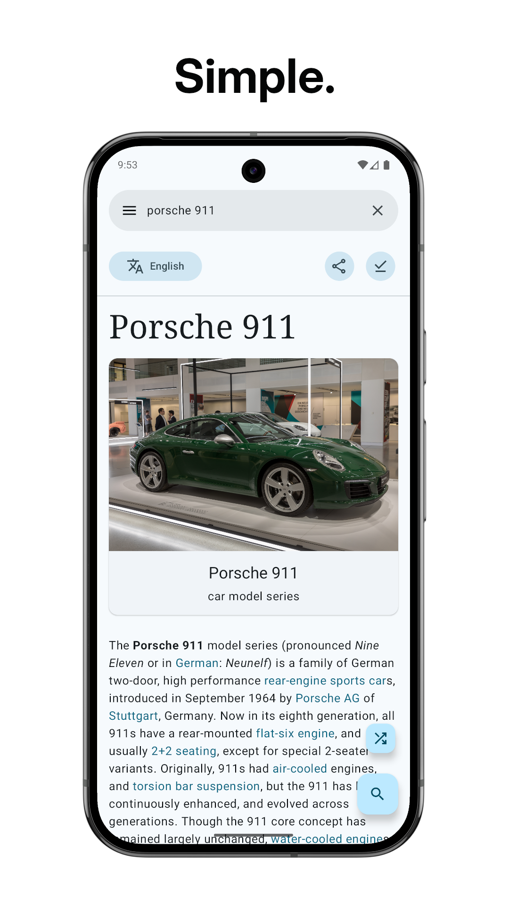
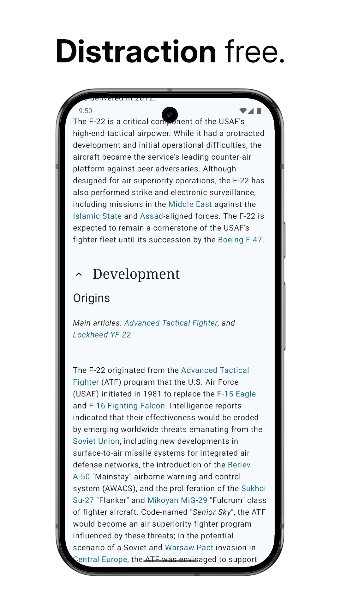
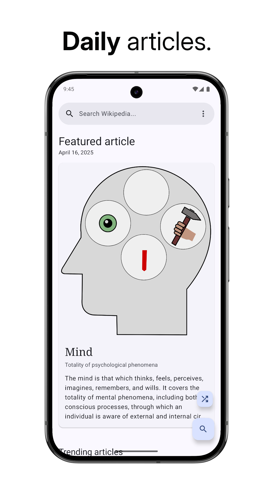
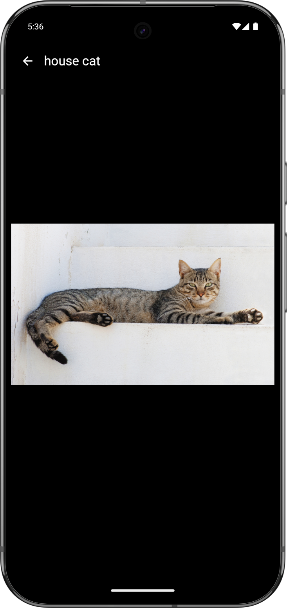
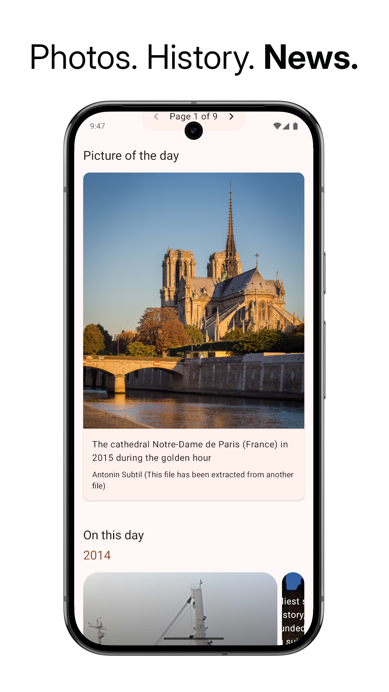
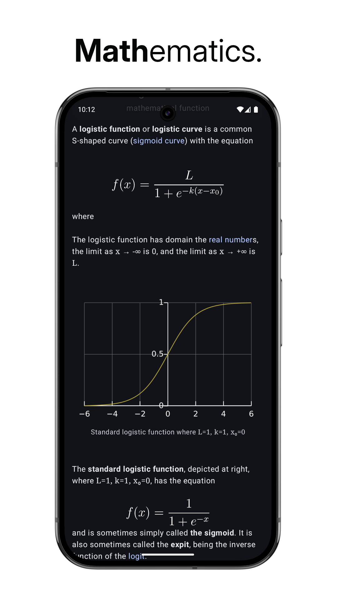

# WikiReader

---

A lightweight Android app for reading Wikipedia articles distraction-free

Supports light mode, dark mode, Material You dynamic colors and 300+ Wikipedia languages

---

## Screenshots

    
    
    

    
    
    

## Features

- **Fast loading:** The article text is loaded before anything else, so you can get to reading,
  quick.
- **Article image:** View an image of the topic from its Wikipedia page. Click on it to enlarge it
  and view in full-screen
- **Random article:** Feeling lucky? Click the random article button to read a random article
- **Choose your language:** Choose from over 300 languages on Wikipedia
- **Save articles:** Download articles to your device for offline reading
- **One-handed use:** Use the floating action buttons at the bottom for a complete one-handed
  experience
- **Lightweight:** The app starts instantly, and works smoothly
- **Material Design 3:** Designed according to the latest Material Design 3 guidelines
- **Smooth animations:** Smooth and fluent animations
- **Customizable colors:** Choose from light/dark themes and customize the Material 3 color palette
- **Customizable font size:** Choose your own comfortable font size
- **Data saver:** Save your limited data plan by loading text only
- **Math expressions:** View properly rendered mathematical expressions for easily reading mathematical articles

## Special Thanks

- [Wikimedia Foundation](https://wikimediafoundation.org/): For providing [Wikipedia](https://wikipedia.org), the largest and most-read reference work in history, for free
- All the Wikipedia volunteers, contributors and donors

This app was made possible by the following libraries:

- [Retrofit 2](https://square.github.io/retrofit/)
- [OkHttp](https://square.github.io/okhttp/)
- [Coil](https://coil-kt.github.io/coil/)
- [MaterialKolor](https://github.com/jordond/MaterialKolor) - Library used for custom color themes

## Star History

<a href="https://star-history.com/#nsh07/wikireader&Date">
 <picture>
   <source media="(prefers-color-scheme: dark)" srcset="https://api.star-history.com/svg?repos=nsh07/wikireader&type=Date&theme=dark" />
   <source media="(prefers-color-scheme: light)" srcset="https://api.star-history.com/svg?repos=nsh07/wikireader&type=Date" />
   
 </picture>
</a>
