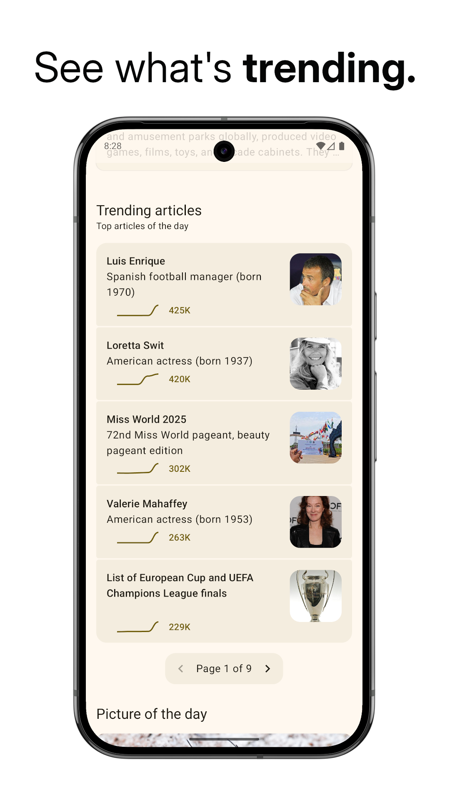

# WikiReader

---

A lightweight Android app for reading Wikipedia articles distraction-free

Supports light mode, dark mode and Material You dynamic colors

---

## Screenshots

    
    
    

    
    
    

## Features

- **Fast loading:** The article text is loaded before anything else, so you can get to reading,
  quick.
- **Article image:** View an image of the topic from its Wikipedia page. Click on it to enlarge it
  and view in full-screen
- **One-handed use:** Use the floating action buttons at the bottom for a complete one-handed
  experience
- **Lightweight:** The app starts instantly, and works smoothly
- **Material Design 3:** Designed according to the latest Material Design 3 guidelines
- **Smooth animations:** Smooth and fluent animations
