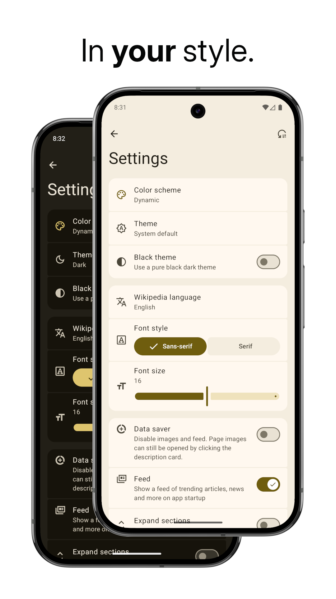

<div align="center">


# WikiReader

</div>

---

<div align="center">

<a href="https://hosted.weblate.org/engage/wikireader/?utm_source=widget">
  
</a>
<a href="https://github.com/nsh07/WikiReader/releases/latest">
  
</a>
<a href="https://f-droid.org/packages/org.nsh07.wikireader">
  
</a>
<a href="https://github.com/nsh07/WikiReader/blob/main/LICENSE">
  
</a>

<br/><br/>

A lightweight Android app for reading Wikipedia articles distraction-free

Supports light mode, dark mode, Material You dynamic colors and 300+ Wikipedia languages

<p>
  <a href="https://apt.izzysoft.de/fdroid/index/apk/org.nsh07.wikireader">
    
  </a>
  <a href="https://f-droid.org/packages/org.nsh07.wikireader">
      
  </a>
</p>
<p>
  <a href="https://hosted.weblate.org/engage/wikireader/">
    
  </a>
</p>

</div>

---

## Screenshots

<p align="center" width="100%">
  
  
  
  
  
  
  
  
</p>

## Features

- **Fast loading:** The article text is loaded before anything else, so you can get to reading,
  quick.
- **Feed:** Read the article of the day, find trending articles and get up to speed on the news with
  the Wikipedia Feed
- **Article image:** View an image of the topic from its Wikipedia page. Click on it to enlarge it
  and view in full-screen
- **Random article:** Feeling lucky? Click the random article button to read a random article
- **Choose your language:** Choose from over 300 languages on Wikipedia
- **Save articles:** Download articles to your device for offline reading
- **One-handed use:** Use the floating action buttons at the bottom for a complete one-handed
  experience
- **Immersive mode:** Hide UI elements while scrolling and enjoy an immersive reading experience
- **Lightweight:** The app starts instantly, and works smoothly
- **Material Design 3:** Designed according to the latest Material Design 3 guidelines
- **Smooth animations:** Smooth and fluent animations
- **Customizable colors:** Choose from light/dark themes and customize the Material 3 color palette
- **Customizable font size:** Choose your own comfortable font size
- **Data saver:** Save your limited data plan by loading text only
- **Math expressions:** View properly rendered mathematical expressions for easily reading
  mathematical articles

## Translation

This project is [available on Hosted Weblate](https://hosted.weblate.org/engage/wikireader/) for
translation.

You can contribute to this project even if you are not a developer by helping in
translating this project into languages you know.

<a href="https://hosted.weblate.org/engage/wikireader/">

</a>

## Download

- **F-Droid** (recommended): WikiReader is available for download on the
  official [F-Droid app store repository](https://f-droid.org/). Updates on F-Droid are generally a
  week late. To get faster updates, you can download WikiReader from
  the [IzzyOnDroid repository](https://apt.izzysoft.de/fdroid/)
- **Obtainium** (recommended): You can add this GitHub repository
  on [Obtainium](https://obtainium.imranr.dev/) to get direct updates from my GitHub releases. This
  is the fastest way to install and update WikiReader.
- **GitHub releases**: Alternatively, you can manually download and install APKs from
  the [Releases](https://github.com/nsh07/WikiReader/releases/latest) section of this repo (This
  method is not recommended, use Obtainium instead).

> [!TIP]
> To [verify](https://developer.android.com/studio/command-line/apksigner#usage-verify) the APK
> downloaded from Obtainium/GitHub, use the following signing certificate fingerprints:
> ```
> SHA1: B1:4E:17:93:11:E8:DB:D5:35:EF:8D:E9:FB:8F:FF:08:F8:EC:65:08
> SHA256: 07:BE:F3:05:81:BA:EE:8F:45:EC:93:E4:7E:E6:8E:F2:08:74:E5:0E:F5:70:9C:78:B2:EE:67:AC:86:BE:4C:3D
> ```
> The SHA256 and MD5 hashes of the individual APK files are also available in the `checksum.txt`
> file for each release.

## Special Thanks

- [Wikimedia Foundation](https://wikimediafoundation.org/): For
  providing [Wikipedia](https://wikipedia.org), the largest and most-read reference work in history,
  for free
- All the Wikipedia volunteers, contributors and donors

This app was made possible by the following libraries:

- [Retrofit 2](https://square.github.io/retrofit/) - REST APIs
- [OkHttp](https://square.github.io/okhttp/) - Networking
- [Coil](https://coil-kt.github.io/coil/) - Loading images from the web
- [MaterialKolor](https://github.com/jordond/MaterialKolor) - For custom color themes
- [ComposeCharts](https://github.com/ehsannarmani/ComposeCharts) - For the view-count history graph in the feed
- [Latex2Unicode](https://github.com/tomtung/latex2unicode) - For converting math into Unicode text

## Star History

<a href="https://star-history.com/#nsh07/wikireader&Date">
 <picture>
   <source media="(prefers-color-scheme: dark)" srcset="https://api.star-history.com/svg?repos=nsh07/wikireader&type=Date&theme=dark" />
   <source media="(prefers-color-scheme: light)" srcset="https://api.star-history.com/svg?repos=nsh07/wikireader&type=Date" />
   
 </picture>
</a>
